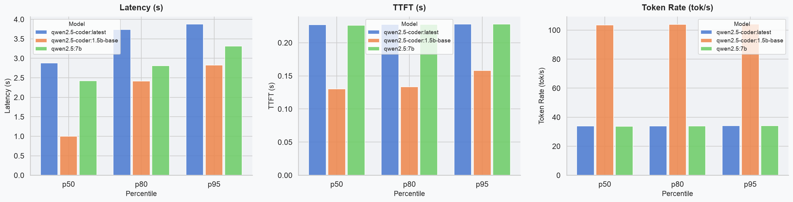
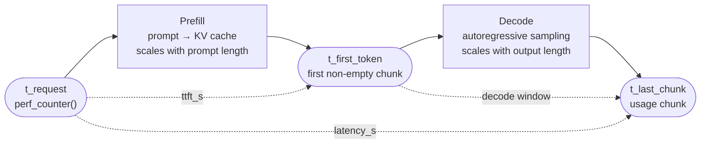
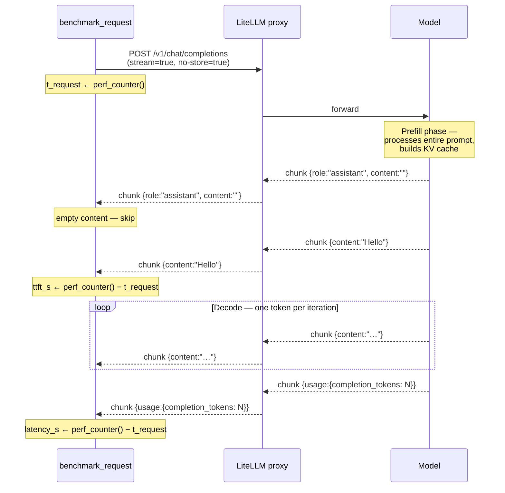

# litellm-benchmark

Benchmarks a [LiteLLM](https://github.com/BerriAI/litellm) proxy across one or more models, measuring latency, time to first token (TTFT), and token rate. Outputs a CSV, a summary CSV with percentiles, a time-series chart, and a percentile chart.

## Example




## Install

```bash
uv sync
```

## Configuration

Set two environment variables before running:

```bash
export LITELLM_BASE_URL=http://localhost:4000
export LITELLM_API_KEY=sk-your-key
```

## Usage

```bash
uv run python main.py \
  --model gpt-4o \
  --model claude-3-5-sonnet \
  --concurrency 5 \
  --requests 20 \
  --warmup 3 \
  --prompt "Write a short poem about benchmarks"
```

Output files are named with a timestamp (`results_20260615_143022.csv`, etc.) so consecutive runs never overwrite each other. Pass `--output` / `--chart` to use fixed paths instead.

| Flag            | Default                                 | Description                                   |
| --------------- | --------------------------------------- | --------------------------------------------- |
| `--model`       | *(required, repeatable)*                | Model name(s) to benchmark                    |
| `--concurrency` | `5`                                     | Max concurrent requests per model             |
| `--requests`    | `20`                                    | Timed requests per model (warmup not counted) |
| `--warmup`      | `3`                                     | Warmup requests per model (results discarded) |
| `--delay`       | `1.0`                                   | Seconds between request launches              |
| `--prompt`      | `"Write a short poem about benchmarks"` | Prompt sent to each model                     |
| `--output`      | `results_<timestamp>.csv`               | Raw CSV output path                           |
| `--chart`       | `chart_<timestamp>.png`                 | Time-series chart path (PNG)                  |

## Output

Four files are written per run:

| File                       | Description                                                                                                                       |
| -------------------------- | --------------------------------------------------------------------------------------------------------------------------------- |
| `results_<ts>.csv`         | One row per request: `model`, `request_index`, `latency_s`, `ttft_s`, `completion_tokens`, `token_rate_tok_s`, `error`, `retries` |
| `results_<ts>_summary.csv` | p50 / p95 / p99 per model per metric                                                                                              |
| `chart_<ts>.png`           | Time-series line chart (latency, TTFT, token rate over request index) with p50/p95 overlay lines and Smooth/Usable/Slow bands     |
| `percentile_<ts>.png`      | Grouped bar chart: p50 / p80 / p95 per model per metric                                                                           |

## Metrics

LLM inference has two distinct computational phases ([BentoML inference metrics](https://bentoml.com/llm/inference-optimization/llm-inference-metrics)):

1. **Prefill** — the model processes the entire prompt in one forward pass and builds the KV cache. Duration scales with prompt length. No tokens are emitted yet.
2. **Decode** — the model autoregressively samples one token at a time, reusing the KV cache. Duration scales with output length.

### Measurement overview

The following diagram shows where each clock reading is taken during a single streaming request:



The sequence below shows exactly what arrives over the wire and when each measurement is recorded:



### `latency_s`

```
latency_s = t_last_chunk − t_request
```

End-to-end wall time. Includes both phases plus network round-trip. Useful for user-facing SLA budgets.

### `ttft_s` — Time to First Token

```
ttft_s = t_first_content_chunk − t_request
```

Time until the server emits the first real content token. Dominated by the prefill phase, so it scales with prompt length — TTFT benchmarks without a fixed prompt length are not comparable ([DigitalOcean benchmarking guide](https://www.digitalocean.com/blog/llm-inference-benchmarking)).

> **Implementation note:** OpenAI-compatible servers send an initial chunk with `delta.role = "assistant"` and `delta.content = ""` before any token is generated. This chunk is skipped; `ttft_s` starts the clock on the first chunk where `delta.content` is non-empty.

### `token_rate_tok_s` — Decode throughput

The standard industry metric is **TPOT** (Time Per Output Token) ([BentoML](https://bentoml.com/llm/inference-optimization/llm-inference-metrics)):

```
TPOT = (latency_s − ttft_s) / (completion_tokens − 1)
```

`token_rate_tok_s` is its inverse — tokens per second during the decode phase:

```
token_rate_tok_s = (completion_tokens − 1) / (latency_s − ttft_s)
```

The `− 1` accounts for the first token being already captured by `ttft_s`; the remaining `completion_tokens − 1` tokens are produced during the decode window `latency_s − ttft_s`. Using total `latency_s` as the denominator would dilute the rate with prefill time and make it prompt-length-dependent. Returns `nan` when output is ≤ 1 token or the decode window is zero.

### `retries`

Number of HTTP 429 responses received before the request succeeded (or was abandoned). Requests are retried up to 3 times with exponential backoff: 1 s, 2 s, 4 s. A non-zero value means the proxy was rate-limiting during the run and the reported latency is understated relative to what a client without retry logic would see.
