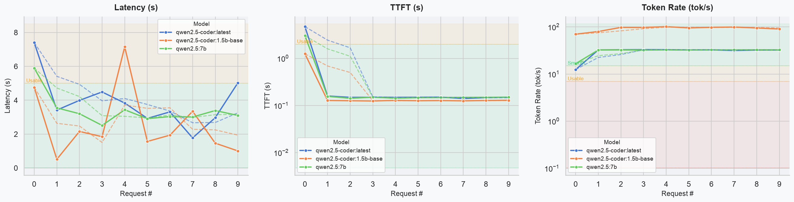

# litellm-benchmark

Benchmarks a [LiteLLM](https://github.com/BerriAI/litellm) proxy across one or more models, measuring latency, time to first token (TTFT), and token rate. Outputs a CSV and a line-chart PNG.

## Example



## Install

```bash
uv sync
```

## Configuration

Set two environment variables before running:

```bash
export LITELLM_BASE_URL=http://localhost:4000
export LITELLM_API_KEY=sk-your-key
```

## Usage

```bash
uv run python main.py \
  --model gpt-4o \
  --model claude-3-5-sonnet \
  --concurrency 5 \
  --requests 20 \
  --prompt "Write a short poem about benchmarks" \
  --output results.csv \
  --chart chart.png
```

| Flag            | Default                               | Description                       |
| --------------- | ------------------------------------- | --------------------------------- |
| `--model`       | *(required, repeatable)*              | Model name(s) to benchmark        |
| `--concurrency` | 5                                     | Max concurrent requests per model |
| `--requests`    | 20                                    | Total requests per model          |
| `--prompt`      | "Write a short poem about benchmarks" | Prompt sent to each model         |
| `--output`      | `results.csv`                         | CSV output path                   |
| `--chart`       | `chart.png`                           | Chart output path (PNG)           |

## Output

- **CSV**: one row per request with columns `model`, `request_index`, `latency_s`, `ttft_s`, `completion_tokens`, `token_rate_tok_s`, `error`
- **Chart**: three line plots (latency, TTFT, token rate) per model with a 3-point rolling-average overlay and color-coded Smooth/Usable/Slow bands