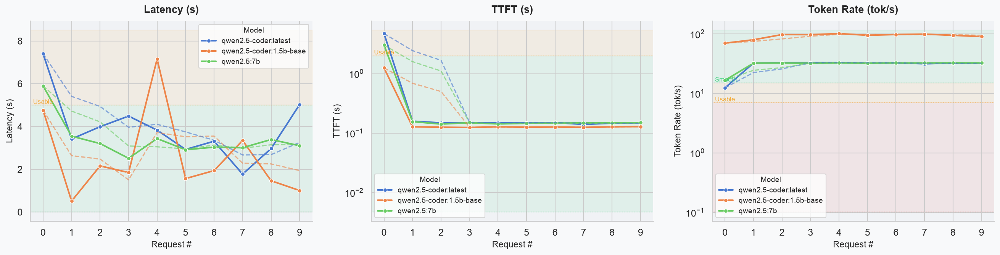
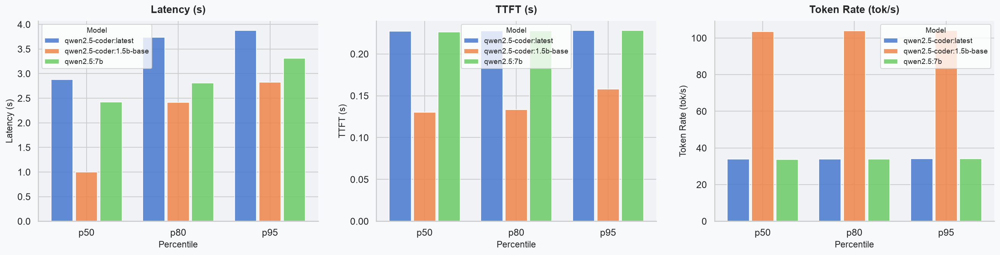
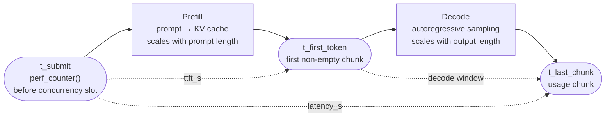
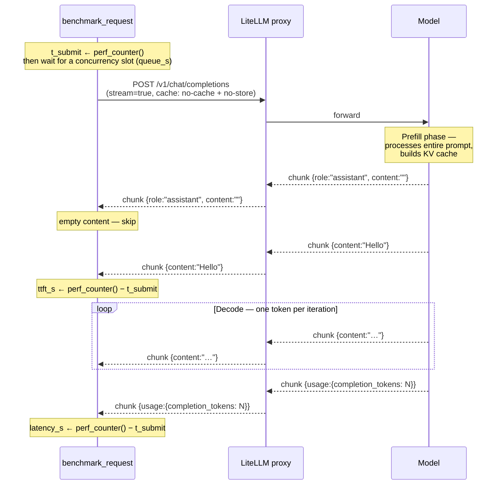

# litellm-benchmark

Answers one question: **of the models behind my [LiteLLM](https://github.com/BerriAI/litellm) proxy, which one is fastest — and where does the time actually go?**

Point it at your proxy, name the models, and it fires a batch of streaming requests at each. You get charts and CSVs breaking every response down into the three numbers that matter for user experience: how long until the answer is finished (**latency**), how long until the first word appears (**TTFT**), and how fast the words stream in after that (**token rate**).

## Example





## Quick start

You need Python 3.13+ and [uv](https://docs.astral.sh/uv/).

```bash
uv sync

export LITELLM_BASE_URL=http://localhost:4000
export LITELLM_API_KEY=sk-your-key

uv run litellm-benchmark \
  --model gpt-4o \
  --model claude-3-5-sonnet \
  --requests 20 \
  --max-tokens 256
```

That benchmarks both models with 20 timed requests each (plus 3 warmup requests that are discarded), then prints the paths of the four output files. `uv run python main.py` works too — same thing.

## What you get

Every run writes four timestamped files, so consecutive runs never overwrite each other:

| File                       | What's inside                                                                                                   |
| -------------------------- | --------------------------------------------------------------------------------------------------------------- |
| `results_<ts>.csv`         | One row per request — raw material for your own analysis                                                        |
| `results_<ts>_summary.csv` | p50 / p95 / p99 per model per metric, plus sample count `n` and the model's `error_rate`                         |
| `chart_<ts>.png`           | Time-series chart: each metric over request index, with rolling mean, p50/p95 lines, and Smooth/Usable/Slow bands |
| `percentile_<ts>.png`      | Bar chart comparing models at p50 / p95 / p99                                                                   |

Raw CSV columns: `model`, `request_index`, `start_time` (seconds since the benchmark started, warmup included, when this request was launched), `queue_s` (time spent waiting for a concurrency slot), `latency_s`, `ttft_s`, `completion_tokens`, `token_rate_tok_s`, `error`, `retries`.

Pass `--output` / `--chart` if you want fixed paths instead of timestamped ones.

## Reading the results

The three metrics correspond to what a person sitting in front of a chat UI experiences:

- **TTFT (time to first token)** — the awkward silence before anything appears. Dominated by prompt processing. For reasoning models, hidden thinking tokens (`reasoning_content`) don't count, so TTFT includes the whole thinking phase.
- **Token rate** — how fast the text streams once it starts. Below reading speed feels sluggish.
- **Latency** — total time until the response is complete. What matters for non-interactive use (pipelines, agents).

The time-series chart shades each plot into comfort bands so you can see at a glance whether a model feels good, tolerable, or painful:

| Band       | Latency | TTFT  | Token rate  |
| ---------- | ------- | ----- | ----------- |
| 🟢 Smooth  | ≤ 5 s   | ≤ 2 s | ≥ 15 tok/s  |
| 🟡 Usable  | 5–15 s  | 2–8 s | 7–15 tok/s  |
| 🔴 Slow    | > 15 s  | > 8 s | < 7 tok/s   |

TTFT and token rate are drawn on a log scale: values cluster near zero with occasional large spikes, and a linear axis would squash the interesting region flat.

Percentiles over averages: p50 is the typical experience, p95 is what your unluckiest users get. A model with great p50 but terrible p95 will still generate complaints. With fewer than ~100 requests per model, p99 is effectively the single worst sample; the tool warns about this after the run.

Failures are not silently dropped: a timed-out request is recorded with the time it waited (a lower bound on its true latency), so timeouts show up in the latency tail. Other errors carry no timings and are counted in `error_rate` instead.

## Flags

| Flag            | Default                                 | Description                                    |
| --------------- | --------------------------------------- | ---------------------------------------------- |
| `--model`       | *(required, repeatable)*                | Model name(s) to benchmark                     |
| `--concurrency` | `5`                                     | Max concurrent requests per model              |
| `--requests`    | `20`                                    | Timed requests per model (warmup not counted)  |
| `--warmup`      | `3`                                     | Warmup requests per model (results discarded)  |
| `--delay`       | `1.0`                                   | Seconds between request launches (all models)  |
| `--timeout`     | `60.0`                                  | Per-request timeout in seconds (`0` disables)  |
| `--max-tokens`  | *(unset)*                               | Cap on completion tokens per request           |
| `--prompt`      | `"Write a short poem about benchmarks"` | Prompt sent to each model                      |
| `--sequential`  | *(off)*                                 | Run models one after another instead of interleaving |
| `--output`      | `results_<timestamp>.csv`               | Raw CSV output path                            |
| `--chart`       | `chart_<timestamp>.png`                 | Time-series chart path (PNG); the percentile chart goes next to it as `<name>_percentile.png` |

**Tips for meaningful numbers:**

- **Comparing models? Set `--max-tokens`.** Without a fixed output length, a chatty model and a terse one produce token rates that aren't comparable — and TTFT comparisons need the same prompt for the same reason.
- **Measuring throughput? Set `--delay 0`.** The default 1-second stagger is gentle load-shaping; with fast models each request finishes before the next launches, so concurrency never actually builds up.
- **Watch `queue_s` and `retries`.** A growing `queue_s` means requests arrive faster than `--concurrency` lets them through; non-zero `retries` means the proxy returned HTTP 429. Both waits are included in `latency_s` and `ttft_s`, because a caller experiences them too.

## How it works

Each request streams the response (`stream=true`) so the phases of LLM inference can be timed separately. Inference has two distinct phases ([BentoML inference metrics](https://bentoml.com/llm/inference-optimization/llm-inference-metrics)):

1. **Prefill** — the model processes the entire prompt in one forward pass and builds the KV cache. Duration scales with prompt length. No tokens are emitted yet.
2. **Decode** — the model autoregressively samples one token at a time, reusing the KV cache. Duration scales with output length.

The diagram shows where each clock reading is taken:


```mermaid
flowchart LR
    A(["t_submit\nperf_counter()\nbefore concurrency slot"])
    B["Prefill\nprompt → KV cache\nscales with prompt length"]
    C(["t_first_token\nfirst non-empty chunk"])
    D["Decode\nautoregressive sampling\nscales with output length"]
    E(["t_last_chunk\nusage chunk"])

    A --> B --> C --> D --> E

    A -. "ttft_s" .-> C
    C -. "decode window" .-> E
    A -. "latency_s" .-> E
```

And the wire-level view of a single request:


```mermaid
sequenceDiagram
    participant B as benchmark_request
    participant P as LiteLLM proxy
    participant M as Model

    note over B: t_submit ← perf_counter()<br/>then wait for a concurrency slot (queue_s)
    B->>P: POST /v1/chat/completions<br/>(stream=true, cache: no-cache + no-store)
    P->>M: forward

    note over M: Prefill phase —<br/>processes entire prompt,<br/>builds KV cache

    M-->>P: chunk {role:"assistant", content:""}
    P-->>B: chunk {role:"assistant", content:""}
    note over B: empty content — skip

    M-->>P: chunk {content:"Hello"}
    P-->>B: chunk {content:"Hello"}
    note over B: ttft_s ← perf_counter() − t_submit

    loop Decode — one token per iteration
        M-->>P: chunk {content:"…"}
        P-->>B: chunk {content:"…"}
    end

    M-->>P: chunk {usage:{completion_tokens: N}}
    P-->>B: chunk {usage:{completion_tokens: N}}
    note over B: latency_s ← perf_counter() − t_submit
```

### `latency_s`

```
latency_s = t_last_chunk − t_submit
```

End-to-end wall time. Includes both phases, network round-trip, and any client-side wait: queueing for a concurrency slot and 429 backoff. The clock starts when the request is launched, not when it is sent. Otherwise a saturated proxy would look fast, because the slow part would be spent in the client's queue (the "coordinated omission" problem; Kleppmann, *Designing Data-Intensive Applications*, p. 14). Useful for user-facing SLA budgets.

### `ttft_s` — Time to First Token

```
ttft_s = t_first_content_chunk − t_submit
```

Time until the server emits the first real content token. Dominated by the prefill phase, so it scales with prompt length — TTFT benchmarks without a fixed prompt length are not comparable ([DigitalOcean benchmarking guide](https://www.digitalocean.com/blog/llm-inference-benchmarking)).

> **Implementation note:** OpenAI-compatible servers send an initial chunk with `delta.role = "assistant"` and `delta.content = ""` before any token is generated. This chunk is skipped; `ttft_s` starts the clock on the first chunk where `delta.content` is non-empty.

### `token_rate_tok_s` — Decode throughput

The standard industry metric is **TPOT** (Time Per Output Token) ([BentoML](https://bentoml.com/llm/inference-optimization/llm-inference-metrics)):

```
TPOT = (latency_s − ttft_s) / (completion_tokens − 1)
```

`token_rate_tok_s` is its inverse — tokens per second during the decode phase:

```
token_rate_tok_s = (completion_tokens − 1) / (latency_s − ttft_s)
```

The `− 1` accounts for the first token being already captured by `ttft_s`; the remaining `completion_tokens − 1` tokens are produced during the decode window `latency_s − ttft_s`. Using total `latency_s` as the denominator would dilute the rate with prefill time and make it prompt-length-dependent. Returns `nan` when output is ≤ 1 token or the decode window is zero. Queue and backoff time cancel out in `latency_s − ttft_s`, so the rate reflects decoding only.

### Retries and caching

Requests hitting HTTP 429 are retried up to 3 times with exponential backoff (1 s, 2 s, 4 s); the `retries` column records the count. Two measures keep LiteLLM's cache from serving canned answers: each prompt gets a unique `[req=N]` suffix, and requests carry `"cache": {"no-cache": true, "no-store": true}` ([LiteLLM cache controls](https://docs.litellm.ai/docs/proxy/caching_controls): the controls must be nested under `cache`; `no-cache` skips lookup, `no-store` skips writing).

### Load pattern

Each model gets its own warmup, then timed requests are launched round-robin across models (`a, b, a, b, …`), `--delay` seconds apart. Launches don't wait for earlier responses, so a slow model builds a queue instead of quietly slowing the load down. Interleaving means that any drift in backend load affects all models equally. `--concurrency` is a separate limit for each model.

Interleaving assumes the models don't share hardware, which holds for a LiteLLM proxy in front of different providers. When they do share it (several models in one local Ollama), they end up waiting on each other and the model that starts second looks slow for no reason of its own. Use `--sequential` in that case: each model is warmed up and benchmarked on its own, and the next model starts only after the previous one finishes.

## Known limitations

- **Sequential mode reintroduces time drift.** Models run at different times, so a change in backend load between them shows up as a model difference.
- **Round-robin order is fixed.** Model A always goes first within a round; with many models and a long `--delay`, consider swapping the order between runs.
- **Timed-out latencies are lower bounds.** A request cut off at `--timeout` would have taken at least that long; raise the timeout if the tail matters.
- **Token rate needs usage data.** If the proxy doesn't return `usage` in the stream, `token_rate_tok_s` is `nan`; the tool prints a warning.

## Development

```bash
uv run pytest -m "not integration"   # unit tests
uv run ruff check . && uv run ruff format --check .
uv run mypy .                        # strict mode
uv run pytest -m integration         # needs a local Ollama instance
```

CI runs lint, format, types, and unit tests on every push and PR.
