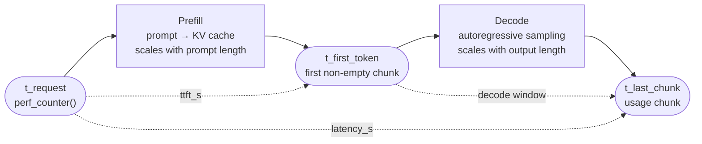
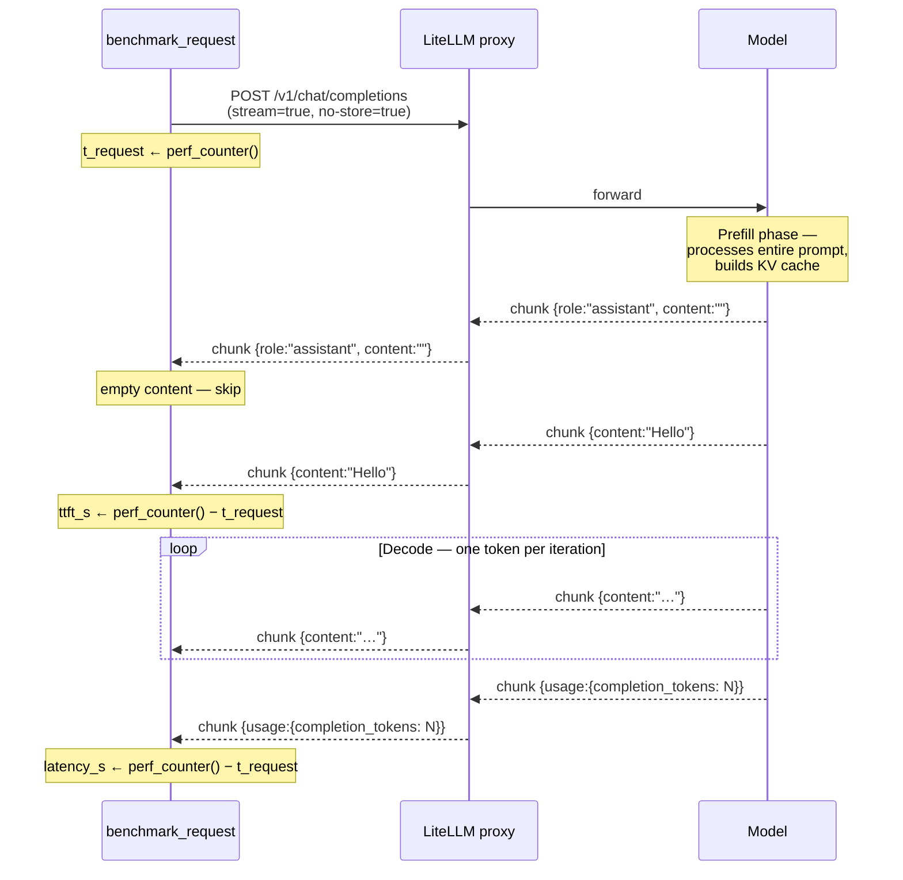

# litellm-benchmark

Answers one question: **of the models behind my [LiteLLM](https://github.com/BerriAI/litellm) proxy, which one is fastest — and where does the time actually go?**

Point it at your proxy, name the models, and it fires a batch of streaming requests at each. You get charts and CSVs breaking every response down into the three numbers that matter for user experience: how long until the answer is finished (**latency**), how long until the first word appears (**TTFT**), and how fast the words stream in after that (**token rate**).

## Example


## Quick start

You need Python 3.13+ and [uv](https://docs.astral.sh/uv/).

```bash
uv sync

export LITELLM_BASE_URL=http://localhost:4000
export LITELLM_API_KEY=sk-your-key

uv run litellm-benchmark \
  --model gpt-4o \
  --model claude-3-5-sonnet \
  --requests 20 \
  --max-tokens 256
```

That benchmarks both models with 20 timed requests each (plus 3 warmup requests that are discarded), then prints the paths of the four output files. `uv run python main.py` works too — same thing.

## What you get

Every run writes four timestamped files, so consecutive runs never overwrite each other:

| File                       | What's inside                                                                                                   |
| -------------------------- | --------------------------------------------------------------------------------------------------------------- |
| `results_<ts>.csv`         | One row per request — raw material for your own analysis                                                        |
| `results_<ts>_summary.csv` | p50 / p95 / p99 per model per metric                                                                            |
| `chart_<ts>.png`           | Time-series chart: each metric over request index, with rolling mean, p50/p95 lines, and Smooth/Usable/Slow bands |
| `percentile_<ts>.png`      | Bar chart comparing models at p50 / p95 / p99                                                                   |

Raw CSV columns: `model`, `request_index`, `start_time` (seconds since benchmark start when the request began), `latency_s`, `ttft_s`, `completion_tokens`, `token_rate_tok_s`, `error`, `retries`.

Pass `--output` / `--chart` if you want fixed paths instead of timestamped ones.

## Reading the results

The three metrics correspond to what a person sitting in front of a chat UI experiences:

- **TTFT (time to first token)** — the awkward silence before anything appears. Dominated by prompt processing.
- **Token rate** — how fast the text streams once it starts. Below reading speed feels sluggish.
- **Latency** — total time until the response is complete. What matters for non-interactive use (pipelines, agents).

The time-series chart shades each plot into comfort bands so you can see at a glance whether a model feels good, tolerable, or painful:

| Band       | Latency | TTFT  | Token rate  |
| ---------- | ------- | ----- | ----------- |
| 🟢 Smooth  | ≤ 5 s   | ≤ 2 s | ≥ 15 tok/s  |
| 🟡 Usable  | 5–15 s  | 2–8 s | 7–15 tok/s  |
| 🔴 Slow    | > 15 s  | > 8 s | < 7 tok/s   |

TTFT and token rate are drawn on a log scale: values cluster near zero with occasional large spikes, and a linear axis would squash the interesting region flat.

Percentiles over averages: p50 is the typical experience, p95 is what your unluckiest users get. A model with great p50 but terrible p95 will still generate complaints.

## Flags

| Flag            | Default                                 | Description                                    |
| --------------- | --------------------------------------- | ---------------------------------------------- |
| `--model`       | *(required, repeatable)*                | Model name(s) to benchmark                     |
| `--concurrency` | `5`                                     | Max concurrent requests per model              |
| `--requests`    | `20`                                    | Timed requests per model (warmup not counted)  |
| `--warmup`      | `3`                                     | Warmup requests per model (results discarded)  |
| `--delay`       | `1.0`                                   | Seconds between request launches               |
| `--timeout`     | `60.0`                                  | Per-request timeout in seconds (`0` disables)  |
| `--max-tokens`  | *(unset)*                               | Cap on completion tokens per request           |
| `--prompt`      | `"Write a short poem about benchmarks"` | Prompt sent to each model                      |
| `--output`      | `results_<timestamp>.csv`               | Raw CSV output path                            |
| `--chart`       | `chart_<timestamp>.png`                 | Time-series chart path (PNG)                   |

**Tips for meaningful numbers:**

- **Comparing models? Set `--max-tokens`.** Without a fixed output length, a chatty model and a terse one produce token rates that aren't comparable — and TTFT comparisons need the same prompt for the same reason.
- **Measuring throughput? Set `--delay 0`.** The default 1-second stagger is gentle load-shaping; with fast models each request finishes before the next launches, so concurrency never actually builds up.
- **Watch the `retries` column.** Non-zero means the proxy returned HTTP 429 during the run, and reported latencies are understated relative to a client without retry logic.

## How it works

Each request streams the response (`stream=true`) so the phases of LLM inference can be timed separately. Inference has two distinct phases ([BentoML inference metrics](https://bentoml.com/llm/inference-optimization/llm-inference-metrics)):

1. **Prefill** — the model processes the entire prompt in one forward pass and builds the KV cache. Duration scales with prompt length. No tokens are emitted yet.
2. **Decode** — the model autoregressively samples one token at a time, reusing the KV cache. Duration scales with output length.

The diagram shows where each clock reading is taken:


```mermaid
flowchart LR
    A(["t_request\nperf_counter()"])
    B["Prefill\nprompt → KV cache\nscales with prompt length"]
    C(["t_first_token\nfirst non-empty chunk"])
    D["Decode\nautoregressive sampling\nscales with output length"]
    E(["t_last_chunk\nusage chunk"])

    A --> B --> C --> D --> E

    A -. "ttft_s" .-> C
    C -. "decode window" .-> E
    A -. "latency_s" .-> E
```

And the wire-level view of a single request:


```mermaid
sequenceDiagram
    participant B as benchmark_request
    participant P as LiteLLM proxy
    participant M as Model

    B->>P: POST /v1/chat/completions<br/>(stream=true, no-store=true)
    note over B: t_request ← perf_counter()
    P->>M: forward

    note over M: Prefill phase —<br/>processes entire prompt,<br/>builds KV cache

    M-->>P: chunk {role:"assistant", content:""}
    P-->>B: chunk {role:"assistant", content:""}
    note over B: empty content — skip

    M-->>P: chunk {content:"Hello"}
    P-->>B: chunk {content:"Hello"}
    note over B: ttft_s ← perf_counter() − t_request

    loop Decode — one token per iteration
        M-->>P: chunk {content:"…"}
        P-->>B: chunk {content:"…"}
    end

    M-->>P: chunk {usage:{completion_tokens: N}}
    P-->>B: chunk {usage:{completion_tokens: N}}
    note over B: latency_s ← perf_counter() − t_request
```

### `latency_s`

```
latency_s = t_last_chunk − t_request
```

End-to-end wall time. Includes both phases plus network round-trip. Useful for user-facing SLA budgets.

### `ttft_s` — Time to First Token

```
ttft_s = t_first_content_chunk − t_request
```

Time until the server emits the first real content token. Dominated by the prefill phase, so it scales with prompt length — TTFT benchmarks without a fixed prompt length are not comparable ([DigitalOcean benchmarking guide](https://www.digitalocean.com/blog/llm-inference-benchmarking)).

> **Implementation note:** OpenAI-compatible servers send an initial chunk with `delta.role = "assistant"` and `delta.content = ""` before any token is generated. This chunk is skipped; `ttft_s` starts the clock on the first chunk where `delta.content` is non-empty.

### `token_rate_tok_s` — Decode throughput

The standard industry metric is **TPOT** (Time Per Output Token) ([BentoML](https://bentoml.com/llm/inference-optimization/llm-inference-metrics)):

```
TPOT = (latency_s − ttft_s) / (completion_tokens − 1)
```

`token_rate_tok_s` is its inverse — tokens per second during the decode phase:

```
token_rate_tok_s = (completion_tokens − 1) / (latency_s − ttft_s)
```

The `− 1` accounts for the first token being already captured by `ttft_s`; the remaining `completion_tokens − 1` tokens are produced during the decode window `latency_s − ttft_s`. Using total `latency_s` as the denominator would dilute the rate with prefill time and make it prompt-length-dependent. Returns `nan` when output is ≤ 1 token or the decode window is zero.

### Retries and caching

Requests hitting HTTP 429 are retried up to 3 times with exponential backoff (1 s, 2 s, 4 s); the `retries` column records the count. Two measures keep LiteLLM's cache from serving canned answers: each prompt gets a unique `[req=N]` suffix, and requests carry `no-store: true`.

## Known limitations

- **Models run sequentially, not interleaved.** Model A finishes all its requests before model B starts, so the second model runs against a warmer proxy/backend. Per-model warmup requests soften this, but for a rigorous head-to-head, run the benchmark twice with the model order swapped.
- **Retried requests time only the last attempt.** The latency of a request that got rate-limited reflects the attempt that succeeded, not the total time including backoff.

## Development

```bash
uv run pytest -m "not integration"   # unit tests
uv run ruff check . && uv run ruff format --check .
uv run mypy .                        # strict mode
uv run pytest -m integration         # needs a local Ollama instance
```

CI runs lint, format, types, and unit tests on every push and PR.
